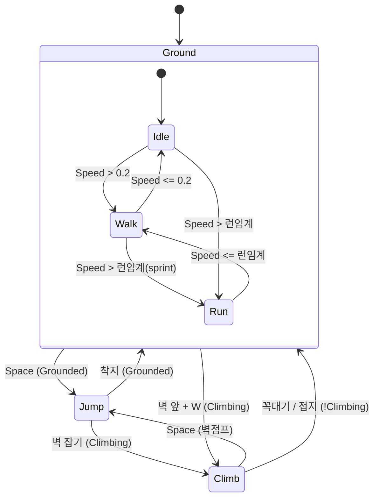
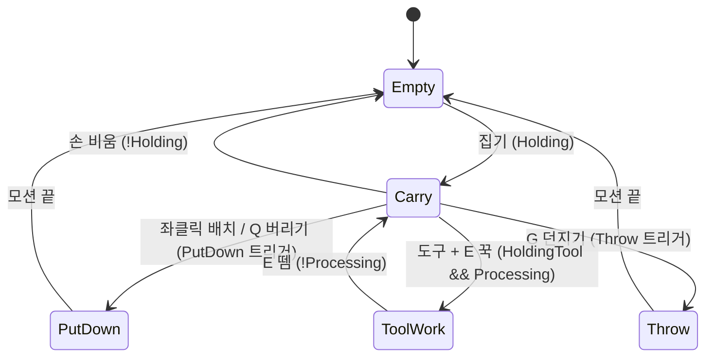

# 플레이어 애니메이션 — 셋업 가이드 & 남은 작업

> 코드(파라미터 구동)는 끝났고, **Animator 에셋 + 클립 연결만 남았다.** 클립 붙기 전까지는 **임시 표시기**(색/크기, 아래 섹션)가 상태를 보여준다. 이 문서대로 붙이면 내 캐릭터가 상태대로 전환된다.

---

## 현재 상태 (코드 완료)

- **`Assets/Player/Scripts/PlayerAnimator.cs`** — 게임 상태를 매 프레임 Animator 파라미터로 세팅하는 스켈레톤.
  - `GetComponentInChildren<Animator>()`로 Animator를 자동으로 잡는다. **Animator가 없으면 아무것도 안 함**(에러/동작 변화 0).
  - 지금은 **내 캐릭터(owner)만** 구동. 원격 캐릭터는 후속(아래 §5).
  - `PlayerUnit.InitComponents`에서 자동 부착되므로 프리팹에 따로 안 붙여도 됨(붙여도 무해).
- 상태 소스(이미 노출됨):
  - `PlayerMovement.IsGrounded()`, `PlayerMovement.IsClimbing`
  - `PlayerCarry.IsHolding`, `IsHoldingTool`, `IsProcessing` + 이벤트 `OnPlace` / `OnThrow`
  - `PlayerInputHandler.MoveInput`, `Rigidbody.linearVelocity`
- **`Assets/Player/Scripts/PlayerStateVisualizer.cs`** — **임시** 표시기. 클립 붙기 전까지 달팽이를 색/크기 펄스/반짝임으로 상태별 표시(owner만). 진짜 애니 붙이면 제거(§6).

---

## 임시 상태 표시기 (지금 굴러가는 것)

클립이 없어서 `PlayerStateVisualizer`가 `MaterialPropertyBlock` 색 틴트 + 크기 펄스로 상태를 임시 표시한다(내 캐릭터/owner만, idle이면 원본 외형 복원).

| 상태 | 표시 |
|---|---|
| idle | 원래 외형 |
| 걷기 | 연두 + 느린 펄스 |
| 대시 | 붉은기 + 빠른 펄스 |
| 점프 | 하늘색 + 세로 늘림 |
| 기어오르기 | 주황 + 펄스 |
| 들고있기 | 초록기 오버레이 |
| 공정(E꾹) | 노랑 반짝 |
| 배치/던지기 | 흰 팝(크기 펀치) |

- 색·속도 튜닝: `PlayerStateVisualizer.cs`의 색 / `pulseSpeed` / `pulseAmp` 숫자만 수정.
- 메쉬가 자식이면 크기 펄스, 루트(물리)면 색만(물리 안 깨지게).

---

## 남은 작업 (Unity 에디터, 순서대로)

1. **Animator 추가** — 플레이어 프리팹의 `Body`(메쉬가 있는 자식)에 `Animator` 컴포넌트 추가. *(PlayerAnimator가 자식에서 자동으로 찾으므로 위치는 Body 권장)*
2. **Animator Controller 생성** — 새 컨트롤러를 만들어 Body의 Animator에 할당.
3. **파라미터 9개 생성** — 아래 §3 표 그대로(이름·타입 정확히).
4. **2레이어 구성** — §2 상태머신대로:
   - **Base Layer** = 이동(idle/walk/run/jump/climb)
   - **Upper Body Layer** = 손동작(carry/putdown/throw/toolwork), **Avatar Mask = 상체만**, **Blending = Override**, Weight = 1
5. **클립 연결** — §4의 9개 클립을 각 상태에 배치하고 전이 조건을 §2/§3대로 설정.

> 끝나면 `PlayerAnimator`가 알아서 파라미터를 채워 상태가 전환된다. 코드 수정 불필요.

---

## §2. 상태머신 설계 (2레이어)

게임상 **걸으면서 물건을 든다**(이동 ≠ 손동작)라서 한 덩어리로 만들면 조합이 폭발한다. 그래서 **Base(이동) + Upper-body(손)** 2레이어.

### Base 레이어 — 이동

- `Jump`은 상승+낙하 하나. 더 살리려면 `Up/Fall`로 쪼개 velocity.y 블렌드.
- `Climb`은 `ClimbDir`(=W/S)로 오르기/내리기/벽에 붙어 정지 블렌드 가능.

### Upper-body 레이어 — 손동작 (상체 마스크 + Override)

- `Empty`(빈손)일 땐 이 레이어 Weight를 0으로 빼서 이동 애니가 그대로 보이게(또는 빈 상태 클립 없이 마스크 OFF).

---

## §3. Animator 파라미터 (이름·타입 정확히)

| 파라미터 | 타입 | 소스(코드) |
|---|---|---|
| `Speed` | Float | 수평 `Rigidbody.linearVelocity` 크기 |
| `Grounded` | Bool | `PlayerMovement.IsGrounded()` |
| `Climbing` | Bool | `PlayerMovement.IsClimbing` |
| `ClimbDir` | Float | `PlayerInputHandler.MoveInput.y` (오르기/내리기 블렌드) |
| `Holding` | Bool | `PlayerCarry.IsHolding` (재료 또는 도구) |
| `HoldingTool` | Bool | `PlayerCarry.IsHoldingTool` (→ ToolWork 진입) |
| `Processing` | Bool | `PlayerCarry.IsProcessing` (E 꾹 작업 중) |
| `PutDown` | Trigger | `PlayerCarry.OnPlace` (배치/버리기) |
| `Throw` | Trigger | `PlayerCarry.OnThrow` (G 던지기) |

> 이름이 다르면 안 잡힌다. `PlayerAnimator.cs`의 `StringToHash` 문자열과 정확히 일치해야 함.

---

## §4. 필요 애니메이션 클립 (9개)

| 클립 | 레이어 | 상태 | 비고 |
|---|---|---|---|
| Idle (가만히) | Base | Idle | 루프 |
| Walk (걷기) | Base | Walk | 루프 |
| Run/Dash (뛰기) | Base | Run | 루프, sprint 임계와 맞물림 |
| Jump (점프) | Base | Jump | 상승+낙하(원하면 분리) |
| Climb (기어오르기) | Base | Climb | 루프, ClimbDir 블렌드 |
| Carry (들고있기) | Upper | Carry | 루프(포즈) |
| PutDown (내려놓기) | Upper | PutDown | 원샷 → Empty (배치/버리기 공용) |
| Throw (던지기) | Upper | Throw | 원샷 → Empty |
| ToolWork (뚝딱뚝딱) | Upper | ToolWork | 루프, 도구 작업 |

---

## §5. 후속 — 원격 캐릭터 애니 (지금은 owner만)

원격 플레이어도 같은 애니로 보이게 하려면(현재는 내 캐릭터만 구동):

- **Speed**: 원격 Rigidbody는 kinematic이라 `linearVelocity`가 0 → `PlayerUnit.m_NetMoving / m_NetSprinting`(이미 복제됨)로 산출하도록 `PlayerAnimator`에 원격 분기 추가.
- **Holding / HoldingTool**: `PlayerCarry.m_NetMaterialId / m_NetTool`(이미 복제됨)에서 파생 → 원격도 됨.
- **Climbing / Processing**: 미복제 → `NetworkVariable<bool>` 추가 복제 필요.
- **PutDown / Throw 원샷**: `ClientRpc`로 멀티캐스트 — `PlayerUnit`의 바운스 복제 패턴(`ReplicateBounce` → `[Rpc]`) 재사용.

---

## §6. 임시 → 진짜 애니로 교체 (나중에 바꾸는 법)

진짜 클립/Animator를 붙일 때:
1. 위 §1~§5대로 `Body`에 Animator + Controller + 클립 연결.
2. **임시 표시기 제거** — `PlayerUnit.InitComponents`의 `PlayerStateVisualizer` 자동부착 줄 삭제(또는 프리팹에서 컴포넌트 제거). **안 지우면** 색 틴트·크기 펄스가 진짜 애니 위에 겹쳐 보임.
3. `PlayerAnimator`(파라미터 구동)는 **그대로 둠** — `GetComponentInChildren<Animator>()`로 Animator를 자동으로 잡아 굴린다.

> 즉 교체 = "클립 연결 + 임시 표시기 한 줄 삭제". 로직 코드는 안 건드림.

---

## 코드 참조

- `Assets/Player/Scripts/PlayerAnimator.cs` — 파라미터 구동(진짜 애니용, 여기만 보면 됨)
- `Assets/Player/Scripts/PlayerStateVisualizer.cs` — **임시** 상태 표시(색/크기). 진짜 애니 붙이면 제거(§6)
- `Assets/Player/Scripts/PlayerMovement.cs` — `IsGrounded()`, `IsClimbing`
- `Assets/Player/Scripts/PlayerCarry.cs` — `IsHolding/IsHoldingTool/IsProcessing`, `OnPlace/OnThrow`
- `Assets/Player/Scripts/PlayerUnit.cs` — `PlayerAnimator`/`PlayerStateVisualizer` 자동 부착, 멀티 복제 패턴
